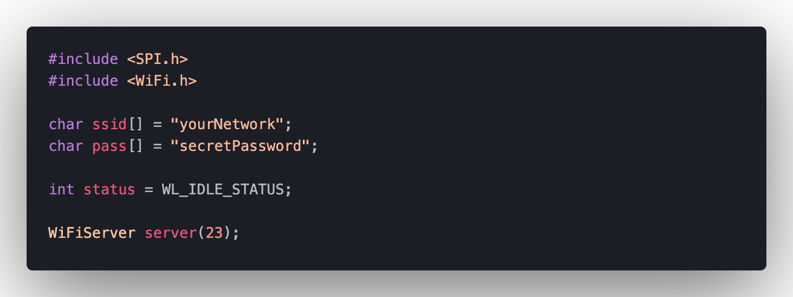
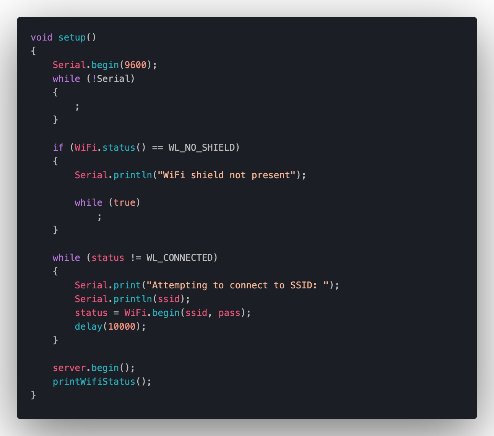
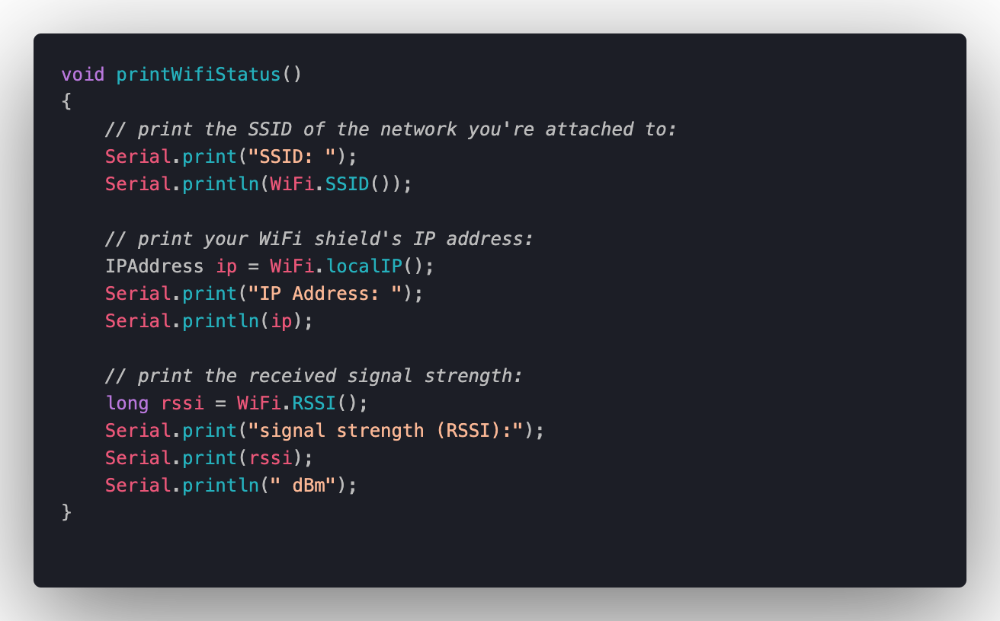
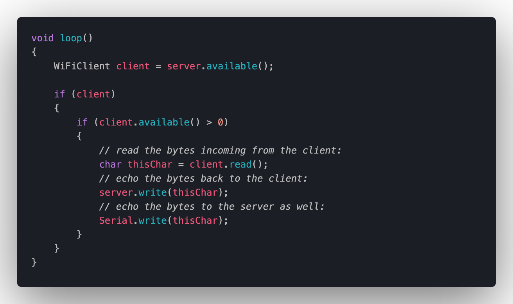
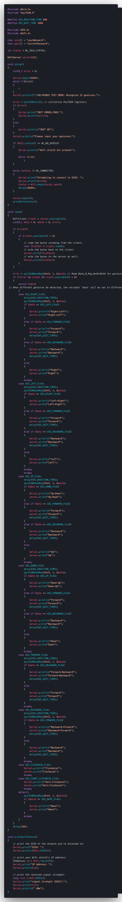

# ArduinoGestureController
A simple Arduino media controller using gestures like [BMW](https://www.youtube.com/watch?v=l8l1SZhccW4)

TODO:// ADD STACKOVERFLOW ISSUE
TODO:// ADD ESP8266-01 ISSUE
TODO:// ADD NODEMCU ISSUE

# Introduction

Gestures have become an essential part of our daily lives since the introduction of touch-screen mobile phones. Since the introduction of these actions, they have made our lives much more comfortable since every gesture is a shortcut, and it is easier for our minds to memorize them since they become muscle memory after a while. As technology moves forth, we are introduced to new possibilities, one of which is touchless gestures. Nowadays, we have access to various sensors that can help the development of such technologies easier.

In this project, we aimed to utilize this concept to control media. Since it's a straightforward implementation of media control using a gesture detector, it can handle various usages, such as car manufacturing, where the driver can control the music without further distractions. As another example, it can get integrated with smart homes to act as a remote controller for TV or stereo to facilitate the owners’ lives.

# Requirements

The explained concept consists of three major parts:

1. The gesture sensor
2. A wireless module to transmit the gestures
3. A software to receive the data and transform them into actions

As we have described in our preliminary report, we used the following modules to construct our sensor to satisfy the description and project requirements.

| Module      | Description |
| :---        |    :----:   |
| Arduino Uno board      | The main module that connects all other modules of the project       |
| PAJ7620U2 sensor   | The gesture detection sensor        |
| ESP8266   | WiFi module        |
| Cable   | Connect Arduino board to the computer        |

The flow of the sensor can be described as following.

1. The person moves his hand in front of the gesture sensor.
2. The gesture is captured and processed on the Arduino board.
3. The gesture gets translated into the action performed by the person.
4. The WiFi module receives the action.
5. The module transmits the action to the software present on a device, using a socket.
6. The device receives the action and acts accordingly.
7. 
We have depicted this flow in the following figure.

# Code

In the distinct phases, we have implemented the code for each of the modules.

## PAJ7620U2

### Header
First, we define timings and import header files. GES_REACTION_TIME is the time between receiving a gesture and displaying the result on the screen. Also, the GES_QUIT_TIME is the amount of time that the output of a gesture is displayed on screen.

### Setup

In the setup function, we initialize the serial port of the arduino, and the PAJ7620U2 sensor, and make sure that no error exists in the initialization.

### Loop

The sensor outputs the received gesture in it's pre-defined flags. With these flags, we can recognize 15 different gestures. The code below uses 8 of these gestures.

## ESP8266

We create a WiFi server using ESP8266.

### Header

In the header section, we define the network username and password for the module to connect. The status variable is the status of the connection and module. In the end, we define the server that we want to use as socket server.

### Setup

In the setup section, we make sure that serial port and the wifi shield are up and running. At the end of the function, we print the status of the network that the chip is connected to.

Later, we will use this status to connect to the server.

### Loop

In this function, we receive the client that is connected to the server, and echo back the data that is transmitted by them.

## Combining WiFi Module and Gesture Sensor

The previous two sections described the code and the functionality of the two main modules distinctly. Now, we want to combine these codes in order to complete our gesture module.

## Web Socket Client

After connecting the modules in the previous sections, we need to connect them to a client in order to control a media player. We used [howler.js](https://github.com/goldfire/howler.js) as the base javascript library to create a music player.

The player is controlled by events. We create a websocket on the player side in order to translate Arduino transferred data into music player actions.

Each case converts the input from the socket server into an action.